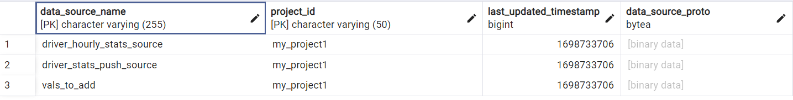
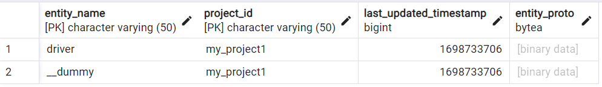
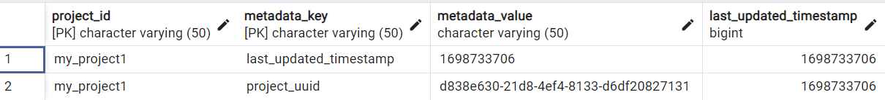
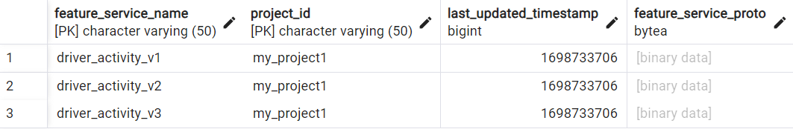
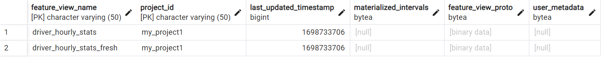
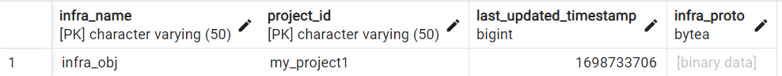
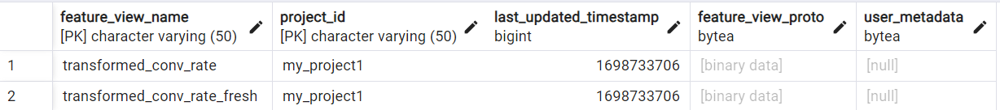
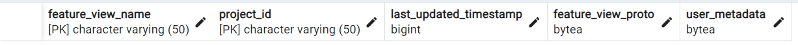
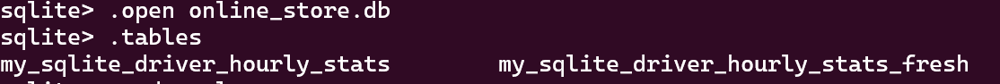
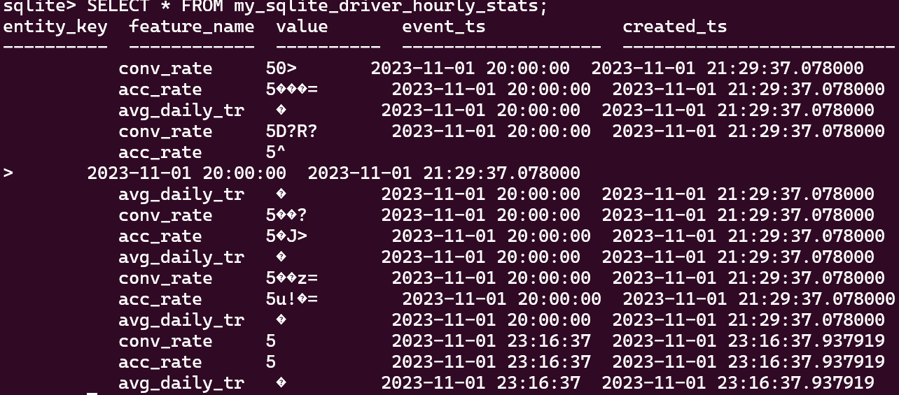

### Understand the Quick Start tutorial of feast.dev  

The feast.dev gives a quick start tutorial about using Feast as a feature store, and it can be found from this [link](https://docs.feast.dev/getting-started/quickstart).

The original tutorial uses a file object as [registry](https://docs.feast.dev/getting-started/concepts/registry) (of defined features). It is serialized by the [Protocol Buffers](https://protobuf.dev/) and will take a little bit more time to understand if you never touch the Protocal Buffers before. Instead, I use SQL Registry and select Postgres. 

The "example_repo.py" defines several features, and they can be viewd on Feast UI (you can run command "feast ui"). They are:  
**Feature Services**:
1. driver_activity_v1
2. driver_activity_v2
3. dirver_activity_v3

**Feature Views**:
1. driver_hourly_stats  
2. driver_hourly_stats_fresh  
3. transformed_conv_rate (on demaned) 
4. transformed_conv_rate_fresh (on demand)

**Data Sources**:
1. diver_hourly_stats_source (File source)
2. vals_to_add (Request Source)  
3. driver_stats_push_source (Push Source)


The Feast writes 11 tables to the SQL Registry (the Postgres DB). They are:
1. data_sources:

2. entities:

3. feast_metadata: it stores the current project related meta info.

4. feature_services:

5. feature_views:

6. managed_infra: records of infra_name and project_id.

7. on_demand_feature_views:

8. request_feature_views: empty for the quick start tutorial.

9. saved_datasets: empty.

10. stream_feature_views: empty.

11. validation_references: empty.


As we can see, the Registry records the relationship among different Feast concepts.

At the same time, the Feast will create two (empty) tables in the online store of it in advance. In this example, I use the default sqlite as online storage. 


Now we have the feature store. If we want to calculate some training data with specific entities and selected features, we can follow the example in [Step 3b](https://docs.feast.dev/getting-started/quickstart#step-3b-generating-training-data-or-powering-batch-scoring-models)  as in the Quick Start tutorial.  It will do the calculation in real-time,  which means no data will be written to Feast.

Let's follow step [Step 3c] to materialize the latest features into the online store. Since we have five different dirvers in the original data (the parquet file), the online store will have the records for them. (Somehow, the entity_key columns display as empty here.)
. 
It worths to use the following setting to have pretty print of Sqlite3:
```
sqlite3> .mode column  
sqlite3> .header on
```

Summary, this study explains several details of the Feast by following the Quick Start tutorial of feast.dev. Hope it is useful.